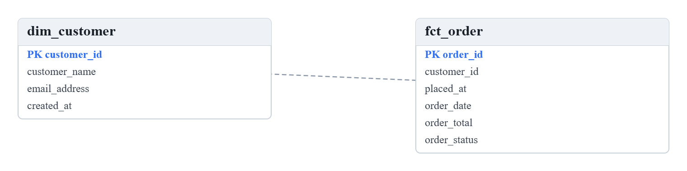

# Strata

**Git-native data modelling for BigQuery and Dataform.**

[](https://github.com/rk-chavali/strata/actions/workflows/ci.yml)
[](LICENSE)
[](https://github.com/rk-chavali/strata/pkgs/container/strata)

A data modelling tool built on two decisions that shape everything else:

1. **The model is files in your git repo.** Not a database with git export. So version
   control, multi-repo sync and merge-based collaboration fall out of git instead of needing
   a hand-built diff/merge/lock engine, and an edit in the UI becomes a reviewable pull
   request rather than a mutation nobody can audit.
2. **Standards are enforced in CI, not in the app.** `strata check` runs in your pipeline, so
   a pull request that breaks a naming standard or a referential rule cannot merge. A
   desktop-only tool gets bypassed the first time someone is busy.



## Try it

```bash
docker run --rm -p 4000:4000 -e STRATA_WORKSPACE=examples/quickstart ghcr.io/rk-chavali/strata
```

Open <http://localhost:4000>. It boots on a small worked example, a shop modelled across all
three tiers, so there is something real on screen rather than an empty canvas. Without that
variable the workspace is empty, which is the right default for a real install and a poor
first impression.

The path is relative on purpose. Git Bash on Windows rewrites any argument that looks like a
Unix path, so `/app/examples/quickstart` reaches the container as
`C:/Program Files/Git/app/examples/quickstart` and the workspace silently fails to load. A
relative path resolves against the image's working directory and is left alone by every shell.

To point it at your own models, bind-mount them. Your repo stays a normal git checkout on the
host, so `git log` there shows exactly what the tool did:

```bash
docker run --rm -p 4000:4000 -v /srv/data-models:/workspace ghcr.io/rk-chavali/strata
```

## Three tiers

Not three views of one artefact. A chain of models linked by `derivedFrom`:

```
conceptual ──> logical ──> physical (raw ──> staging ──> mart)
```

Mappings between them carry the transformations: SCD1/2/3 dimensions, surrogate key strategy,
point-in-time dimension lookups, conformed-dimension registration. Those mappings are what
generates the Dataform SQLX.

## The CI gate

The point of the whole thing. `strata check` validates structure and lints names, and
`--format github` emits annotations that render inline on the pull request, against the
changed lines:

```bash
strata check --format github
```

Exit codes: `0` clean, `1` findings, `2` usage error, so a pipeline can tell a broken model
from a broken invocation. Standards live in the repo next to the model, which makes changing
a standard itself a reviewable change.

Getting the binary into your pipeline is the part still being settled. The container carries
it, so today that is a `docker run` against the image with your repo mounted. An npm package
under `@strata/cli` is the intended path and is not published yet; this README will say so
plainly when it is, rather than earlier.

## You do not have to start from scratch

Point Strata at a dataset you already have and it reads `INFORMATION_SCHEMA` to build the
model, then tells you when the two have drifted apart:

| Route | What it does |
| --- | --- |
| `POST /api/import/bigquery/analyze` | Shows what it would create. Writes nothing |
| `POST /api/import/bigquery/apply` | Writes those objects into a model, as files you then propose |
| `POST /api/import/bigquery/drift` | Compares a live dataset against the model and emits the `ALTER` that closes the gap |

**Drift never executes anything.** It returns SQL for a person to read. Changes BigQuery
cannot make in place are reported as comments, never as runnable statements, because a
migration you must not run unattended should not look like one you can.

Which is also why Strata asks for so little: it reads schemas and never writes to your
warehouse, so the credentials it needs are `roles/bigquery.metadataViewer`,
`roles/bigquery.jobUser`, and `roles/datacatalog.viewer` if you use policy tags. Nothing with
`dataEditor`, `dataOwner`, or `admin` in the name. See [the reverse-engineering
details](#reverse-engineering-and-drift) below.

## What is not built yet

Named plainly so nobody is surprised:

- **Selective apply**: you can see a diff and generate the migration, but not choose which
  individual changes to take. This is the gap between a diff viewer and a migration tool
- **Visual diff and semantic merge** of models (git's textual diff is what you get)
- **Drag-to-connect relationships** on the canvas: create the relationship object instead
- **SSO and SCIM**: local accounts only
- **Editing Dataform connections from the UI**: edit `strata.config.yaml` directly

There is deliberately **no licensing, no seat counting and no activation**. This is open
source and self-hosted: you run the image in your own infrastructure, and nothing in it
phones home or needs a key. Access control is the role model above, plus whatever your
network and IdP already enforce.

## Docs

Full walkthroughs are in [`docs/`](docs/index.html). Open `docs/index.html` in a browser,
or serve the folder.

| Page | Covers |
| --- | --- |
| [Quickstart](docs/quickstart.html) | Running Strata in five minutes, plus a tour of the example |
| [How the model works](docs/concepts.html) | The three tiers, domains, skills, the workflow |
| [Self-hosting](docs/self-hosting.html) | Docker and Kubernetes walkthroughs, accounts, backups |
| [Deploy to the cloud](docs/deploy-cloud.html) | Which hosts fit, what the free tiers really give you |
| [Configuration](docs/configuration.html) | Every environment variable |
| [Security](docs/security.html) | Who protects what, and a pre-launch checklist |
| [CLI](docs/cli.html) | Commands, exit codes, the CI gate |

## Contributing

[CONTRIBUTING.md](CONTRIBUTING.md) covers how to run it from a clone, how this project tests,
and the comment style. It also has a section called **Things this project deliberately does
not do**, which is worth reading before opening a feature request.

Security issues go to [SECURITY.md](SECURITY.md), never a public issue.

---

<details>
<summary><b>Running from a clone</b></summary>

```bash
pnpm install && pnpm build
```

Two terminals:

```bash
pnpm dev:server
```

```bash
pnpm dev:web
```

Open http://localhost:5173. It loads `examples/quickstart`, a small shop modelled
across all three tiers: two concepts become two entities become two BigQuery tables.
Point it elsewhere with `STRATA_WORKSPACE=/path/to/model-repo pnpm dev:server`.

</details>

<details>
<summary><b>Self-hosting with Docker</b></summary>

```bash
docker compose up --build
```

Then open http://localhost:4000. The container serves the UI and the API together.
It holds no state: your model repo is a bind mount and stays a normal git checkout
on the host, so `git log` there shows exactly what the tool did.

```bash
STRATA_WORKSPACE_HOST=/srv/data-models GITHUB_TOKEN=ghp_xxx docker compose up -d
```

| Variable | Purpose |
| --- | --- |
| `STRATA_WORKSPACE_HOST` | Host path to your model repo (bind-mounted at `/workspace`) |
| `GITHUB_TOKEN` | Opens pull requests automatically. Without it you still get branch, commit, push and a compare link |
| `GIT_AUTHOR_NAME` / `GIT_AUTHOR_EMAIL` | Fallback commit attribution; a signed-in user's own name is used when available |
| `SSH_DIR` | Mounted read-only, for SSH git remotes |
| `STRATA_DATA_DIR` | Accounts and session secret. A named volume by default, kept outside the model repo on purpose |
| `STRATA_COOKIE_SECURE` | Set `true` when serving over HTTPS |
| `STRATA_AUTH` | `off` disables authentication entirely |

</details>

<details>
<summary><b>Authentication and roles</b></summary>

On by default. The first person to open a fresh instance creates the administrator, so there is no default password to forget to change.

| Role | Can |
| --- | --- |
| `viewer` | Read models and diagrams |
| `editor` | Edit models, move boxes, propose pull requests |
| `admin` | Also change settings, file layout and accounts |

Roles are enforced **on the server**; the UI only disables what it knows will be
refused. Passwords are scrypt-hashed, sessions are stateless signed cookies so a
restart does not sign everyone out, and credentials live in `STRATA_DATA_DIR`, never in the
the model repo.

Set `STRATA_AUTH=off` for single-user local work. That means anyone who can reach the port
can edit, so only do it behind something else.

This is local-account auth. For a real enterprise rollout the right answer is OIDC/SAML
against your own IdP plus SCIM provisioning; that is not built, and these roles are the
layer it would slot into.

</details>

<details>
<summary><b>The CLI in full</b></summary>

```bash
node packages/cli/dist/bin.js check --cwd examples/quickstart
```

| Command | What it does |
| --- | --- |
| `strata init [dir]` | Create a model repo (`strata.config.yaml` plus `.gitattributes`) |
| `strata check` | Validate structure and lint names. **The CI gate** |
| `strata validate` | Structural and referential integrity only |
| `strata lint` | Naming standards only |
| `strata fmt [--check]` | Rewrite files in canonical form; `--check` fails if they are not |
| `strata reorganize --preset X` | Move every file to a different layout |
| `strata info` | Summarise the workspace |

Exit codes: `0` clean, `1` findings, `2` usage error. `--format github` emits
annotations that render inline on a pull request.

</details>

<details>
<summary><b>The UI, and why it is shaped like this</b></summary>

Three regions and nothing else: a **top bar**, a **sidebar**, a **content area**, plus a
status bar along the foot. Every persistent surface has a fixed home. The thing this
replaced had a top bar, an icon rail, a sliding panel *and* five surfaces floating over
the canvas, each with its own z-index and its own idea of where the canvas ended.

| Region | Holds |
| --- | --- |
| Top bar | Brand, workspace, `⌘K`, Propose, who else is here, your account |
| Sidebar | Overview, the model tree, Problems, Changes, Compare, Generated output, Settings |
| Page | A title, tabs, actions top-right, and one scrolling body |
| Status bar | Model validity and git state. Always visible, never over the diagram |

**Every view is a URL.** `/models/shop_warehouse`, `/problems`, `/settings/git`, so the
back button works, a refresh keeps your place, and a view can be pasted into a chat.

**`⌘K` is the primary way to get anywhere.** It searches commands, models and every
object on the server, so finding `dim_customer` does not require knowing which product,
tier and folder it lives under. That is what let a ribbon's worth of buttons come off the
chrome.

**Editing happens on the diagram**, not in a panel off to one side:

| Gesture | Result |
| --- | --- |
| Double-click a box title | Rename |
| Double-click a row | Edit the column/attribute name and type |
| `+ Add column` on a box | Append a member, ready to name |
| Right-click a row | Toggle primary key, delete member |
| Right-click a box | Add member, edit as YAML, delete |
| Right-click empty canvas | New object, text box, auto layout, fit |
| Double-click empty canvas | Add a text box |
| Drag | Positions persist to the diagram file, debounced |

Toggling a member into the primary key promotes it to `REQUIRED` automatically, rather
than emitting a validation error for you to go and fix.

**Everything else**: a **YAML dialog** reaches every field in the metamodel, so nothing is
unreachable. **Problems** groups findings by rule: one bad naming standard is "one rule,
40 places", not forty separate problems to read. **Generated output** is a changeset, not
an inventory: it shows the two files that would change, not the fifty that would not.
**Propose changes** branches, commits, pushes and opens a PR. It is blocked if the model has
validation errors, with an override. Light and dark themes.

**On first run**, the Overview carries a setup checklist that ticks itself off as git, a
remote, a PR token and a first model appear, and disappears once there is nothing left to
do. A self-hosted tool that boots to an empty canvas has told the operator nothing about
whether the install finished.

</details>

<details>
<summary><b>File layout is yours</b></summary>

Where a file sits carries **no meaning**. Every object declares its own `kind`,
`id` and owning `model` in the file itself, and the loader globs and reads content. It never infers anything from a path, so you can reorganise whenever you like:

```bash
strata reorganize --preset by-layer --dry-run
```

Presets: `flat`, `by-kind`, `by-model`, `by-model-and-kind`, `by-subject-area`,
`by-layer`, `single-file-per-model`, or `custom` with your own templates
(`models/{model}/{layer}/{name}.yaml`). A test asserts that switching between them
leaves the semantic content byte-identical.

</details>

<details>
<summary id="reverse-engineering-and-drift"><b>Reverse engineering and drift, in detail</b></summary>

You do not have to start from an empty canvas. Point Strata at a dataset you already have:

| Route | What it does |
| --- | --- |
| `POST /api/import/bigquery/analyze` | Reads `INFORMATION_SCHEMA` and shows what it would create. Writes nothing |
| `POST /api/import/bigquery/apply` | Writes those objects into a model, as files you then propose |
| `POST /api/import/bigquery/drift` | Compares a live dataset against the model and emits the `ALTER` that closes the gap |

Body: `{ "dataset": "project.dataset", "model": "warehouse", "location": "EU" }`. The
dataset may be `project.dataset` or just `dataset` when the model already names a project
in its BigQuery target. `INFORMATION_SCHEMA` is regional, so give `location` for anything
outside the US multi-region.

Three things worth knowing before you run it:

- **Nested columns arrive as their type text**, `STRUCT<line1 STRING, postcode STRING>`,
  rather than as a field tree. The type is correct and generates valid DDL; the individual
  fields are not separately editable until someone expands them. The import says so.
- **Drift never executes anything.** It returns SQL for a person to read. Changes BigQuery
  cannot make in place are reported as comments, never as runnable statements, because a
  migration you must not run unattended should not look like one you can.
- **Re-importing over an existing model needs `overwrite`**, and refuses without it. A bare
  warehouse read has no descriptions, no classifications and no ownership, so applying one
  over a curated model would quietly delete the work that makes the model worth having.

It needs Google credentials: a service account under the `gcp.serviceAccount` secret, or
`STRATA_GCP_ACCESS_TOKEN` for a quick try. On a hosted deployment those are the tenant's own,
never the operator's.

**Grant it the least it can work with.** Strata reads schemas and never writes to your
warehouse, so the account it uses does not need to be able to:

| Role | Why |
| --- | --- |
| `roles/bigquery.metadataViewer` | Read table and column definitions. No table data. |
| `roles/bigquery.jobUser` | Run the `INFORMATION_SCHEMA` queries. Reading schemas means running a query, and a query is a job. |
| `roles/datacatalog.viewer` | Only if you use policy tags. Read taxonomies to reference in DDL. |

Those three are the whole requirement. Notably absent: `dataEditor`, `dataOwner`, and
anything with `admin` in the name. If a role you were about to grant would let Strata change
a table, it is more than Strata can use.

The OAuth scopes follow the same rule: BigQuery calls request `auth/bigquery` rather than
`auth/cloud-platform`. Data Catalog publishes nothing narrower than `cloud-platform`, so
that one call is broader than we would like and `datacatalog.viewer` is what keeps it
read-only in practice. The roles are the lock that binds; the scope is the second one.

</details>

<details>
<summary><b>Packages in this repo</b></summary>

| Package | Contents |
| --- | --- |
| `@strata/metamodel` | Objects for all three tiers, domains, UDPs, mappings, BigQuery type parser and change classifier, validation, naming standards engine |
| `@strata/storage` | Workspace config, layout engine, git-friendly YAML serialization, layout-independent discovery |
| `@strata/ddl` | BigQuery DDL, Dataform SQLX, `ALTER` generation, data dictionary, governance policies, policy-tag taxonomy |
| `@strata/query` | Column-level lineage and impact, workspace search, dictionary rows, cost advice, classification suggestions |
| `@strata/import` | erwin XML, DDL scripts, CSV, and a live BigQuery dataset, through one neutral IR |
| `@strata/cli` | The CI gate, plus a read-only MCP server over the model |
| `@strata/server` | Read/write API, git and PR operations, serves the built UI |
| `@strata/web` | ERD canvas, editor, changes panel, problems panel |

918 tests. `pnpm test`, `pnpm typecheck`.

</details>

<details>
<summary><b>Line endings</b></summary>

Model files are always written with LF endings and `strata init` writes a
`.gitattributes` to pin that. Without it, git on Windows checks files back out as
CRLF and every file looks modified, which buries the diffs this tool exists to
produce.

</details>
